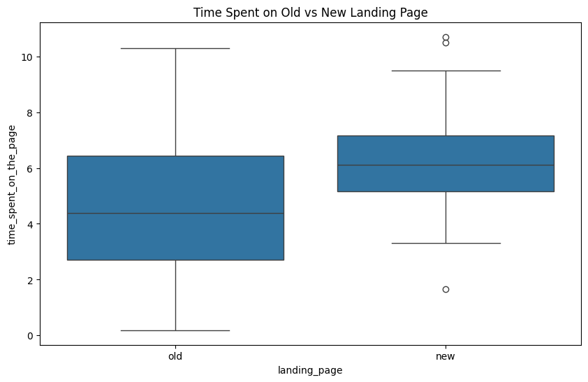
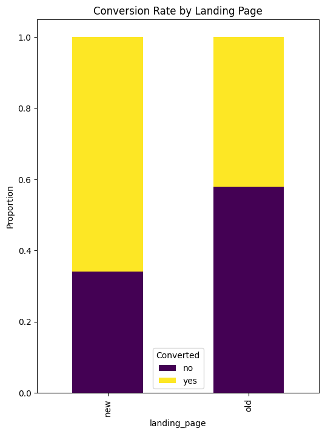
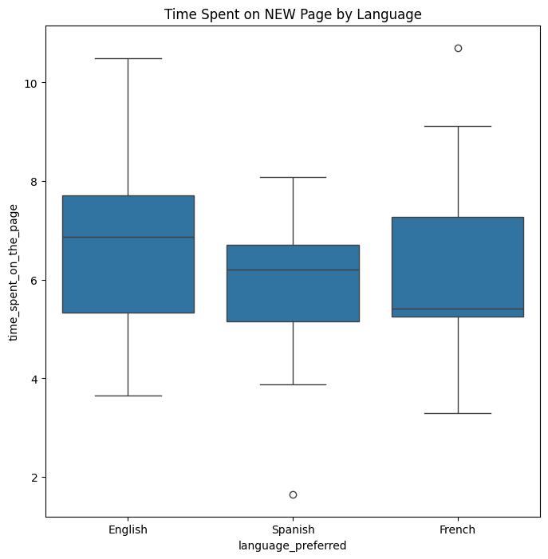

# e-news-express-ab-testing-analysis
A/B testing and statistical analysis project for evaluating landing page performance and conversion behavior.
# E-News Express A/B Testing Analysis

## Project Overview
This project analyzes the effectiveness of a new landing page design for E-News Express, an online news platform.

The goal of the analysis is to determine whether the new landing page improves user engagement and conversion compared to the existing landing page.

This project applies exploratory data analysis and statistical hypothesis testing to support business decision-making.

---

## Business Objective
E-News Express wants to increase subscriptions by improving the design and relevance of its landing page.

The company conducted an A/B test to compare user behavior on the old and new landing pages.

---

## Dataset
The dataset contains information about user interactions with the two landing page versions.

### Variables:
- **user_id** – Unique user identifier
- **group** – Control or treatment group
- **landing_page** – Old or new landing page
- **time_spent_on_the_page** – Time spent on the page (in minutes)
- **converted** – Whether the user subscribed or not
- **language_preferred** – User’s preferred language

---

## Key Questions Answered
1. Do users spend more time on the new landing page than on the old landing page?
2. Is the conversion rate higher for the new landing page?
3. Does conversion depend on preferred language?
4. Is time spent on the new page the same across language groups?

---

## Tools & Libraries
- Python
- Pandas
- NumPy
- Matplotlib
- Seaborn
- SciPy
- Statsmodels

---

## Methods Used
- Exploratory Data Analysis (EDA)
- Data Cleaning
- Hypothesis Testing
- Two-sample independent t-test
- Two-sample proportions z-test
- Chi-square test of independence
- One-way ANOVA

---

## Key Business Value
This project demonstrates how statistical analysis can be used to evaluate product changes, user engagement, and conversion performance in a business setting.

---

## Files Included
- `E_News_Express_Project.ipynb` – Jupyter notebook
- `E_News_Express_Project.html` – Exported notebook version
- `abtest.csv` – Dataset used for analysis

---
## Visualizations

### Time Spent on Old vs New Landing Page

### Conversion Rate Comparison

### Time Spent by Preferred Language

# Conclusion
Based on the analysis of the A/B test data, the following conclusions can be drawn:

### The new landing page keeps users engaged for a longer time.
The statistical test (one‑tailed t‑test) showed that users spend significantly more time on the new page compared to the old one. This indicates that the updated design and content increase user engagement.

### The new page has a higher conversion rate.
The proportion test (one‑tailed z‑test) confirmed that the conversion rate on the new page is significantly higher than on the old one. The new page is more effective at turning visitors into subscribers.

### Conversion does not depend on preferred language.
The chi‑square test showed no statistically significant relationship between the user’s language and the likelihood of conversion. This means that the interface language does not influence the decision to subscribe.

### Time spent on the new page is consistent across language groups.
ANOVA showed that the average time spent on the new page does not differ between users who prefer English, French, or Spanish. The new page performs equally well across all segments.

# Business Recommendations:
### 1. Fully roll out the new landing page.
It demonstrates improved performance across two key metrics:

engagement (time on page)

conversion rate.

This directly contributes to an increase in the number of subscribers.

### 2. Focus on optimizing content rather than language.
Since language does not affect either conversion or time on page:

there is no need to create separate design versions for different languages.

resources are better allocated to improving User Experience, Call to Action elements, and content personalization.

### 3. Continue A/B experiments with elements of the new page.
It is recommended to test:

different Call to Action variations

text length

placement of key content blocks

personalized article recommendations.

These experiments can further increase conversion.

### After launching the new page, it is important to track:

conversion rate

time on page

depth of engagement (pages per session).

This will allow timely responses to changes in user behavior.

5. Consider content personalization based on interests rather than language.
Since language does not influence user behavior, but interests do, personalized article recommendations and tailored content blocks can increase engagement.

## Author
Portfolio project completed as part of a business statistics and data analytics learning path.
